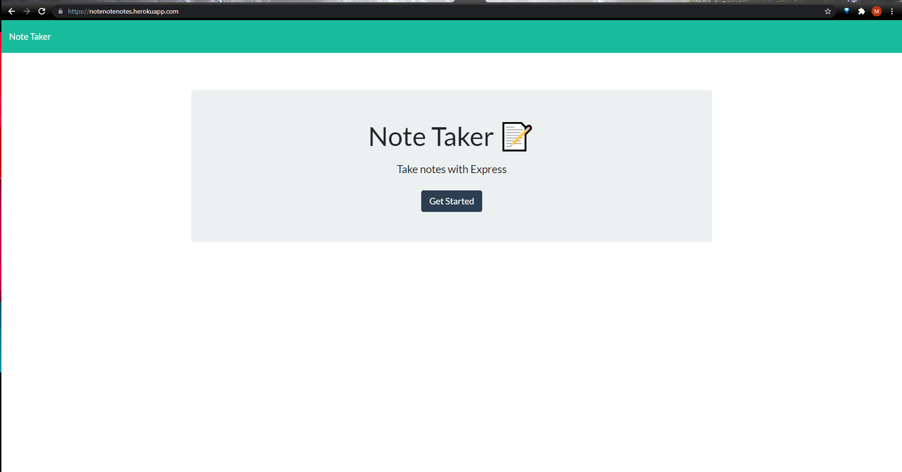
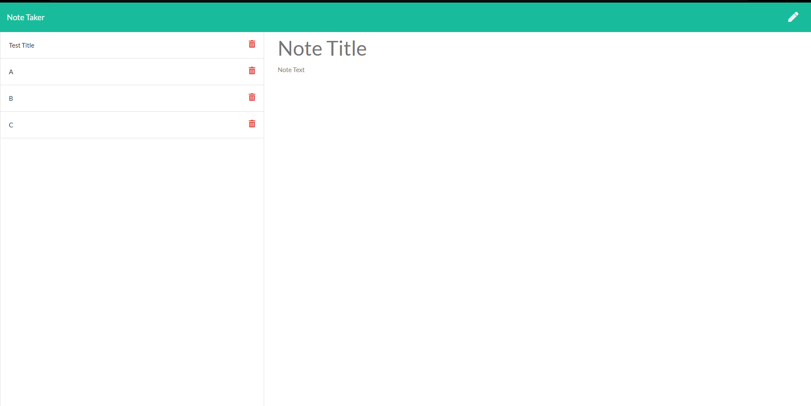

# Notes Taker
 
## Description: 
This is an application that will let you create, save, and delete detailed notes. This application uses node.js and an express server. You can install and run on a local server, or use the deployed version.     
## Table of Contents: 
* [Installation](#installation)
* [Usage](#usage) 
* [License](#license) 
* [Contributing](#contributing) 
* [Questions](#questions) 
## Installation: 
[Click here for deployed app](https://notenotenotes.herokuapp.com) 

If you would like to run it locally, run npm install after cloning the repo, and then run node server.js You can then find it at 
## Usage: 
Click the Get Started button, then you can enter a note title, and detailed text for the note.  Once text is in both fields the save icon will appear and you can click to save. Saved note titles are displayed on the left, and when you click on the title you will see the text in the main field.  Clicking on the pencil icon will let you enter a new note.  Click the red trash can icon to delete any note you wish to remove. Clicking on Note Taker in the header will take you back to the home page. 

## License: 
Licensed under the [MIT](https://opensource.org/licenses/MIT) license. 
## Contributing: 
Feel free to contact me to contribute to this project. My contact information is listed below.

## Questions: 
GitHub: [melinamboedecker](https://github.com/melinamboedecker) 

If you have any additional questions, please contact me at melinamboedecker@gmail.com